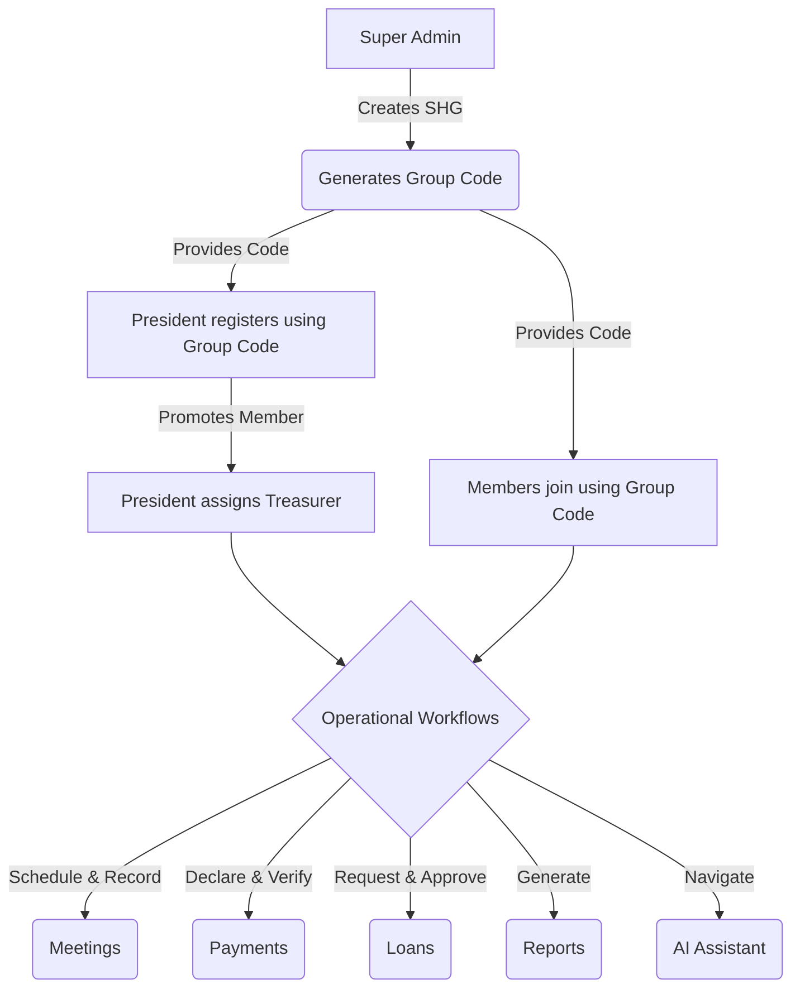

# SHG Digital Record Platform

A mobile-first, bilingual (Marathi & English) record-keeping and governance transparency platform for Self Help Groups (SHGs). Built specifically for rural women in Maharashtra, India. It operates as a native Android app with an integrated Super Admin dashboard for centralized management.

---

## 1. Project Overview

The **SHG Digital Record Platform** is a mobile-first, bilingual (Marathi & English) record-keeping and governance transparency platform for Self Help Groups (SHGs). Built specifically for rural women in Maharashtra, India. It digitizes the financial and operational record-keeping, automating contribution tracking, late fee generation, meeting attendance, and loan approvals.

A unique feature of this platform is the **AI Voice Assistant**, designed specifically for rural SHGs with lower digital literacy. By speaking in Marathi or English, members and presidents can ask the platform to instantly navigate to reports, request loans, or check payment statuses.

---

## 2. Major Features

- **Super Admin Dashboard (Web only)**: Centralized oversight for NGO staff to manage SHG deployments.
- **SHG Creation**: Super Admins can create new SHGs.
- **Secure Group Code Generation**: Unique codes are generated per SHG for secure onboarding.
- **President Registration**: SHG Presidents register and claim their group using the Group Code.
- **Member Registration**: Members join securely using the unique Group Code.
- **Role Assignment**: The President can seamlessly promote members to the Treasurer role.
- **Role-Based Access**: Explicit permission modeling for Super Admin, President, Treasurer, and Member.
- **Member Management**: Adding, suspending, and monitoring group members.
- **Meeting Management**: Schedule meetings, track attendance, and record minutes.
- **Monthly Contribution Management**: Core ledger tracking for expected monthly savings.
- **Contribution Start Month**: Accurate automated billing synchronized to a member's specific start month.
- **Automatic Monthly Payment Generation**: Monthly dues are created systematically.
- **Late Fee Automation**: Programmable late fee structures (fixed or percentage) applied automatically on overdue payments.
- **Loan Workflow**: End-to-end loan request, review, and approval lifecycle.
- **Loan Repayment Tracking**: Tracking principal and interest repayments.
- **Financial Summary Dashboard**: Real-time calculation of Current Balance (Savings + Late Fees + Repayments - Loans).
- **Comprehensive Reports**: Member Register, Savings Reports, Loan Reports, and Financial Summaries.
- **PDF Generation**: Localized (Marathi & English) PDF statements exportable directly to the device.
- **AI Voice Assistant**: Voice-activated, LLM-powered intent classification for app navigation.
- **Localization**: Full Marathi & English support across the UI, PDFs, validation, and AI responses.
- **QR Payment Support**: Upload and display group QR codes for digital contribution payments.
- **Mobile-First Architecture**: Built natively for Android with Expo React Native.

---

## 3. Workflow

The platform follows a strict hierarchical onboarding and operational workflow:



---

## 4. Tech Stack

| Layer | Technology |
|---|---|
| **Frontend / Mobile** | Expo React Native (v54), Expo Router, React (v19.1) |
| **Backend** | Node.js, Express.js |
| **Database** | PostgreSQL |
| **ORM** | Drizzle ORM |
| **Authentication** | Token-based sessions with UUIDs |
| **AI / NLP** | Groq API (`llama-3.1-8b-instant`), Android Native Speech Recognition |
| **PDF Generation** | Expo Print (`expo-print`) |
| **Language** | TypeScript |
| **Deployment** | Web-build proxy serving, esbuild, Android APK/AAB |

### Key Libraries Used
- `@expo-google-fonts/poppins`, `@expo/vector-icons`
- `@react-native-async-storage/async-storage`
- `@tanstack/react-query`
- `drizzle-orm`, `drizzle-zod`
- `expo-router`, `expo-speech-recognition`, `expo-print`, `expo-location`
- `express`, `ws`, `pg`
- `groq-sdk`
- `zod`, `zod-validation-error`

---

## 5. Project Structure

```text
app/
  _layout.tsx             Root layout and contexts
  index.tsx               Auth gate & redirect logic
  +not-found.tsx          404 fallback
  (auth)/                 Login and Register flows
  (main)/                 Primary tabs (Dashboard, Meetings, Payments, More)
  (super-admin)/          Super Admin Web Dashboard
  create-loan.tsx         Loan request logic
  create-meeting.tsx      Meeting scheduling
  history.tsx             Presidential history logs
  loan/[id].tsx           Loan detail & repayment tracking
  loan-settings.tsx       Group loan configuration
  member/[id].tsx         Detailed member profile & history
  members.tsx             Member directory
  reports.tsx             Configurable reporting UI
  rules.tsx               Group governance rules
  shg-settings.tsx        President operational settings
components/
  ConfirmDialog.tsx       Reusable confirmation modal
constants/
  Colors.ts               Theme tokens
contexts/
  AuthContext.tsx         Session management
  DataContext.tsx         Data caching and API mutations
  LanguageContext.tsx     Localization engine (English/Marathi)
lib/
  api.ts                  Fetch wrapper & API utilities
  nlpHandler.ts           Voice recognition & Groq routing logic
  pdf-generator.ts        HTML-to-PDF rendering logic
server/
  index.ts                Express entry point
  routes.ts               Main API definitions
  super-admin-routes.ts   Super Admin API definitions
  invitation-routes.ts    Invitation code APIs
  storage.ts              Drizzle DB and Memory storage implementations
  db.ts                   PostgreSQL connection
  db-init.ts              Super Admin initialization logic
  cron.ts                 Automated late fee & contribution generation
shared/
  schema.ts               Drizzle schema (Single Source of Truth)
```

---

## 6. AI Features

The platform features a native **Voice Assistant** to help users navigate complex menus using natural language.

- **Voice Recognition**: Utilizes `expo-speech-recognition` to capture audio natively on Android without requiring continuous cloud streaming.
- **Groq LLM**: Transcripts are sent to the backend and processed via the Groq API (`llama-3.1-8b-instant`).
- **Intent Classification**: The LLM determines the user's intent (e.g., "I want to see the savings report") and maps it to specific app routes (`/reports`).
- **Bilingual Support**: Fully supports both Marathi and English voice inputs and returns localized AI responses.

---

## 7. Reports

The application provides extensive reporting capabilities exportable as fully localized PDFs.

- **Savings Report**: Breakdown of member contributions, late fees, and totals.
- **Loan Report**: Comprehensive list of active and completed loans with principal and interest breakdowns.
- **Financial Summary Report**: High-level group metrics, including exact Current Balance.
- **Member Register Report**: Detailed roster including Contribution Status, Pending Months, Active Loans, and Total Contributions.

**Filters Available:**
- Monthly & Yearly
- Custom Date Range
- All Time
- Active Loans vs Completed Loans

---

## 8. Security

- **Role-Based Permissions**: Strict backend and frontend checks restricting views and actions based on user roles (`super_admin`, `president`, `treasurer`, `member`).
- **Group Isolation**: Every API query is scoped to the authenticated user's `groupId`, ensuring SHGs cannot access each other's data.
- **Invitation Codes**: Time-limited and usage-capped codes prevent unauthorized registration.
- **Group Codes**: Required for claiming the President role during onboarding.
- **Environment Variables**: Sensitive credentials (like the Super Admin login and Groq API key) are exclusively managed via `.env` and never leaked to the client bundle.
- **Soft Deletion**: Members and records utilize status flags (e.g., `suspended`, `inactive`) rather than hard database deletions to preserve historical ledger integrity.

---

## 9. Localization

The platform is built from the ground up for full bilingual usage.

- **Scope**: The entire UI, validation messages, alert dialogs, generated PDFs, and AI Voice Assistant responses support both **Marathi** and **English**.
- **Implementation**: Hardcoded strings are eliminated. Everything routes through `LanguageContext.tsx` using `t("key")`.
- **User Preference**: Language settings are persistent per device and synchronized with the backend.

---

## 10. Setup Instructions

### Prerequisites
- Node.js 22
- npm
- Android Studio / SDK (for mobile builds)

### Installation

1. **Install dependencies:**
   ```bash
   npm install
   ```

2. **Configure Environment Variables:**
   Create a `.env` file in the root directory:
   ```env
   # Server
   PORT=5000
   
   # Database (Supabase recommended)
   SUPABASE_DATABASE_URL=postgresql://postgres...
   DATABASE_URL=postgresql://...
   
   # Security & API
   SESSION_SECRET=your_secure_secret
   GROQ_API_KEY=your_groq_api_key
   
   # Frontend API Endpoint
   EXPO_PUBLIC_API_URL=http://localhost:5000
   
   # Super Admin Credentials
   SUPER_ADMIN_PHONE=9999999999
   SUPER_ADMIN_PASSWORD=securepassword
   SUPER_ADMIN_NAME=NGO Admin
   ```

3. **Initialize Database:**
   ```bash
   npm run db:push
   ```

4. **Run Development Servers:**
   Open two terminals:
   
   Terminal 1 (Backend):
   ```bash
   npm run server:dev
   ```
   
   Terminal 2 (Frontend/Expo/Web):
   ```bash
   npm run expo:dev
   ```

### Building for Android
To generate an APK for testing or release:
```bash
npx expo export --platform android
cd android
./gradlew assembleRelease
```

---

## 11. Screens

<!-- Placeholder: Add Dashboard Screenshot Here -->
<!-- Placeholder: Add Member Register Screenshot Here -->
<!-- Placeholder: Add Financial Summary Screenshot Here -->
<!-- Placeholder: Add AI Voice Assistant Screenshot Here -->

---

## 12. Future Improvements

- **SMS/WhatsApp Integration**: Automated notifications for pending payments and upcoming meetings.
- **Bank Account Integration**: Exporting disbursement files for direct banking compatibility.
- **Cloud Backup**: Automated end-to-end encrypted backup of group records.
- **iOS Support**: While currently mobile-first for Android, minor native module tweaks will enable full iOS deployment.

---

## 13. Contributors

Developed and maintained as a digital infrastructure project for rural empowerment.

---

## 14. License

[MIT License](LICENSE)
